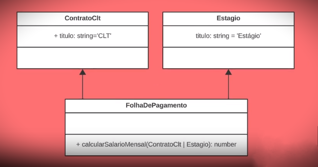
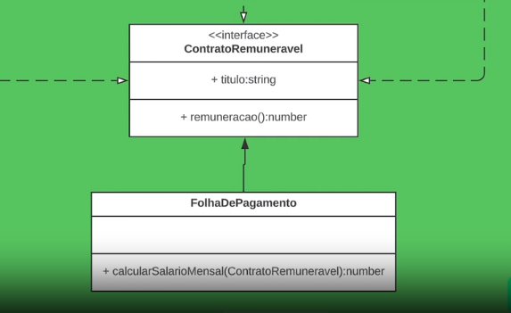

## Objetivo - 2

Recebemos um código onde gere as contratações de uma empresa, onde possuem dois modelos: CLT e estágio. Agora querem implementar o PJ, e otimizar o código conforme as boa práticas. A estrutura do código está assim:



O objetivo é a ‘`FolhaDePagamento`’ depender de uma abstração. No caso, a abstração é uma interface chamada ‘`ContratoRemunerado`’, que possui o título que tinhamos antigamente, que é o nome da classe, e o método ‘`remuneracao()`’. Ficando assim:



## Princípio aberto/fechado

> _“Objetos ou entidades devem estar abertos para extensão, mas fechados para modificações”_ - Bertrand Meyer

No caso da folha de pagemento do código anterior, nos extendemos novas funcionalidades adicionando o contrato PJ como opção, mas sem alterar o que já estava funcionando.

### Um exemplo mais prático sobre aberto/fechado

Vamos pensar no exemplo de um restaurante, onde temos os objetos 1, 2 e 3, sendo:

1 - Gancho para fazer pão;

2 - Batedor-globo para fazer biscoitos;

3 - Batedor-globo para fazer sorvetes;

**Todos eles podem ser usados na batedeira planetária,** porque existe uma abstração dessa batedeira. A extremidade de todos os objetos podem ser encaixadas na batedeira e ela fará com que eles girem e funcionem conforme o seu formato.

A forma errada de fazer isso em código é assim:

```tsx
type Batedor = "globo" | "leque" | "gancho";

class BatedeiraPlanetaria {
  constructor(public batedor: Batedor) {}

  bater() {
    if (this.batedor === "globo") {
      console.log("Com esse batedor eu posso fazer sorvete!");
    }

    if (this.batedor === "leque") {
      console.log("Com esse batedor eu posso fazer biscoito!");
    }

    if (this.batedor === "gancho") {
      console.log("Com esse batedor eu posso fazer pão!");
    }
  }
}
```

A forma correta:

```tsx
interface Batedor {
  bater(): void;
}

class BatedorGlobo implements Batedor {
  bater() {
    console.log("Com esse batedor eu posso fazer sorvete!");
  }
}

class BatedorLeque implements Batedor {
  bater() {
    console.log("Com esse batedor eu posso fazer biscoito!");
  }
}

class BatedeiraPlanetaria {
  batedor: Batedor;

  constructor(batedor: Batedor) {
    this.batedor = batedor;
  }

  bater() {
    this.batedor.bater();
  }
}
```

## Implementando uma nova forma de contrato

Para começar vamos criar a interface ‘`ContratoRemuneravel`’:

```tsx
interface ContratoRemuneravel {
  titulo: string;
  remuneracao(): number;
}
```

agora precisamos que os modelos de contratos implementem essa interface:

```tsx
class Estagio implements ContratoRemuneravel {
  titulo: string = "Estagiário";
}
```

precisamos colocar colocar o método ‘`remuneracao()`’:

```tsx
class Estagio implements ContratoRemuneravel {
  titulo: string = "Estagiário";
  remuneracao(): number {
    return GANHO_POR_HORA_ESTAGIARIO * CARGA_HORARIA_DIARIA_ESTAGIARIO;
  }
}
```

veja que agora nos temos as variaveis dentro do contrato, então não precisamos de variaveis globais para isso.

```tsx
class Estagio implements ContratoRemuneravel {
  private GANHO_POR_HORA_ESTAGIARIO = 14;
  private CARGA_HORARIA_DIARIA_ESTAGIARIO = 4;

  titulo: string = "Estagiário";
  remuneracao(): number {
    return (
      this.GANHO_POR_HORA_ESTAGIARIO * this.CARGA_HORARIA_DIARIA_ESTAGIARIO
    );
  }
}
```

Agora basta reeplicarmos isso para os outros contratos, ficando assim:

```tsx
class ContratoClt implements ContratoRemuneravel {
  private GANHO_POR_HORA_CLT = 24;
  private CARGA_HORARIA_DIARIA_CLT = 8;

  titulo: string = "CLT";
  remuneracao(): number {
    return this.GANHO_POR_HORA_CLT * this.CARGA_HORARIA_DIARIA_CLT;
  }
}

class Estagio implements ContratoRemuneravel {
  private GANHO_POR_HORA_ESTAGIARIO = 14;
  private CARGA_HORARIA_DIARIA_ESTAGIARIO = 4;

  titulo: string = "Estagiário";
  remuneracao(): number {
    return (
      this.GANHO_POR_HORA_ESTAGIARIO * this.CARGA_HORARIA_DIARIA_ESTAGIARIO
    );
  }
}

class ContratoPJ implements ContratoRemuneravel {
  private GANHO_POR_HORA_PJ = 36;
  private CARGA_HORARIA_DIARIA_PJ = 8;

  titulo: string = "PJ";
  remuneracao(): number {
    return this.GANHO_POR_HORA_PJ * this.CARGA_HORARIA_DIARIA_PJ;
  }
}
```

Na classe pagamento, vamos remover os varios if e vamos implementar nosso método ‘`remuneracao()`’

```tsx
class FolhaDePagamento {
  static calcularSalarioMensal(funcionario: ContratoRemuneravel): number {
    return funcionario.remuneracao() * MES_COMERCIAL;
  }
}
```

Agora altermaos as propriedades de `ContratoClt | Estagio` para `ContratoRemuneravel`, saindo de um um classe de com varios if para uma com apenas uma funçao.

### Antes

```tsx
{
  const GANHO_POR_HORA_CLT = 24;
  const CARGA_HORARIA_DIARIA_CLT = 8;

  const GANHO_POR_HORA_ESTAGIARIO = 14;
  const CARGA_HORARIA_DIARIA_ESTAGIARIO = 4;

  const MES_COMERCIAL = 20; //dias trabalhados no mês
  class ContratoClt {
    titulo: string = "CLT";
  }

  class Estagio {
    titulo: string = "Estágio";
  }

  class FolhaDePagamento {
    static calcularSalarioMensal(funcionario: ContratoClt | Estagio): number {
      if (funcionario instanceof ContratoClt) {
        return GANHO_POR_HORA_CLT * CARGA_HORARIA_DIARIA_CLT * MES_COMERCIAL;
      } else if (funcionario instanceof Estagio) {
        return (
          GANHO_POR_HORA_ESTAGIARIO *
          CARGA_HORARIA_DIARIA_ESTAGIARIO *
          MES_COMERCIAL
        );
      }
      return 0;
    }
  }

  const funcionarioClt = new ContratoClt();
  const funcionarioEstagiario = new Estagio();

  console.log(
    `Sou ${
      funcionarioClt.titulo
    } e meu salário líquido mensal é R$ ${FolhaDePagamento.calcularSalarioMensal(
      funcionarioClt
    )}`
  );
  console.log(
    `Sou ${
      funcionarioEstagiario.titulo
    } e meu salário líquido mensal é R$ ${FolhaDePagamento.calcularSalarioMensal(
      funcionarioEstagiario
    )}`
  );
}
```

### DEPOIS

```tsx
{
  const MES_COMERCIAL = 20; //dias trabalhados no mês

  interface ContratoRemuneravel {
    titulo: string;
    remuneracao(): number;
  }
  class ContratoClt implements ContratoRemuneravel {
    private GANHO_POR_HORA_CLT = 24;
    private CARGA_HORARIA_DIARIA_CLT = 8;

    titulo: string = "CLT";
    remuneracao(): number {
      return this.GANHO_POR_HORA_CLT * this.CARGA_HORARIA_DIARIA_CLT;
    }
  }

  class Estagio implements ContratoRemuneravel {
    private GANHO_POR_HORA_ESTAGIARIO = 14;
    private CARGA_HORARIA_DIARIA_ESTAGIARIO = 4;

    titulo: string = "Estagiário";
    remuneracao(): number {
      return (
        this.GANHO_POR_HORA_ESTAGIARIO * this.CARGA_HORARIA_DIARIA_ESTAGIARIO
      );
    }
  }

  class ContratoPJ implements ContratoRemuneravel {
    private GANHO_POR_HORA_PJ = 36;
    private CARGA_HORARIA_DIARIA_PJ = 8;

    titulo: string = "PJ";
    remuneracao(): number {
      return this.GANHO_POR_HORA_PJ * this.CARGA_HORARIA_DIARIA_PJ;
    }
  }

  class FolhaDePagamento {
    static calcularSalarioMensal(funcionario: ContratoRemuneravel): number {
      return funcionario.remuneracao() * MES_COMERCIAL;
    }
  }

  const funcionarioClt = new ContratoClt();
  const funcionarioEstagiario = new Estagio();
  const funcionarioPJ = new ContratoPJ();

  console.log(
    `Sou ${
      funcionarioClt.titulo
    } e meu salário líquido mensal é R$ ${FolhaDePagamento.calcularSalarioMensal(
      funcionarioClt
    )}`
  );
  console.log(
    `Sou ${
      funcionarioEstagiario.titulo
    } e meu salário líquido mensal é R$ ${FolhaDePagamento.calcularSalarioMensal(
      funcionarioEstagiario
    )}`
  );

  console.log(
    `Sou ${
      funcionarioPJ.titulo
    } e meu salário líquido mensal é R$ ${FolhaDePagamento.calcularSalarioMensal(
      funcionarioPJ
    )}`
  );
}
```
