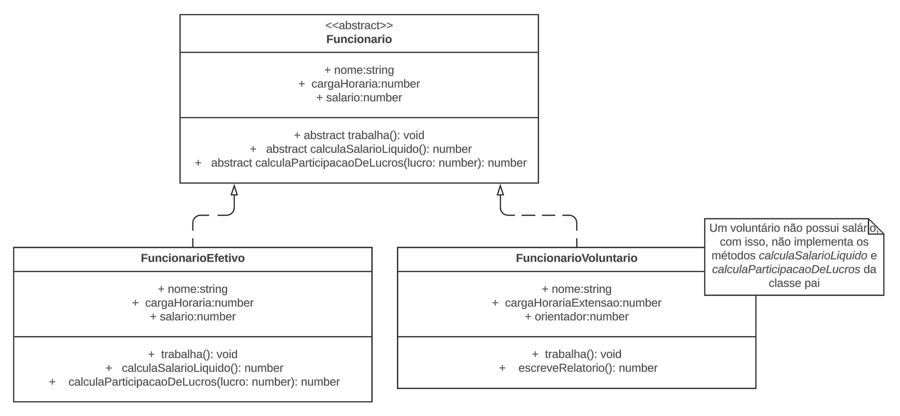

## Objetivo - 3

O sistema possui dois tipos de funcionarios:

1. O **efetivo,** que traz retorno financeiro para empresa e é remunerado
2. E o **voluntário,** que é uma pessoa que acompanha um funcionário efetivo que a orienta.Essa pessoa estudante realiza suas pesquisas, entrega relatórios, e formula o seu TCC.

O problema é que a modelagem do sistema foi realizada de forma apressada, e foi começada diretamente pelo código, não houve um momento para pensar nas abstrações.



O que vamos fazer é transoformar a interface ‘`Funcionario`’ um pouco mais simples. E destrinchar em outos dois interfaces, um que vai lidar com ‘`FuncionarioEfetivo`’ e ‘`FuncionarioVoluntario`’


## Princípio da substituição de Liskov

> _“Uma classe derivada poder ser substituída por sua classe base”_ - Interpretação da frase de Barbara Liskov

### Exemplo mais intuitivo

Para explicar melhor, trouxemos um exemplo no contexto de um restaurante, onde pai e filha cozinham juntos.


O pai diz que é importante que a filha aprenda a cozinhar para ajudar no restaurante onde trabalham. No segundo quadro, chega uma pessoa cliente e pede para fazer o melhor lanche. O pai, então, entrega um *cheeseburger*, o que agrada à pessoa cliente, que agradece.

Agora, observe outro cenário, onde a filha já aprendeu, ou pelo menos esperamos que tenha aprendido a fazer lanche, uma pessoa cliente chega e pede novamente o melhor lanche.


Agora traduzindo isso para os códigos, fica da seguinte maneira:

```tsx
//errado
{
  class CozinheiroPai {
    fazerLanche(): string {
      return "X-Burguer";
    }
  }

  class CozinheiraFilha extends CozinheiroPai {
    fazerLanche(): string {
      throw new Error("Não sei fazer lanches");
    }
    fazerSuco(): string {
      return "Preparando um suco bem refrescante";
    }
  }

  const cozinheiroPai = new CozinheiroPai();
  console.log(cozinheiroPai.fazerLanche()); // Saída: X-Burguer

  const cozinheiraFilha = new CozinheiraFilha();
  console.log(cozinheiraFilha.fazerLanche()); // Erro!
}
```

```tsx
//certo

class CozinheiroPai {
  fazerLanche(): string {
    return "X-Burguer";
  }
}

class CozinheiraFilha extends CozinheiroPai {
  fazerLanche(): string {
    return super.fazerLanche() + ", adicionando bacon, ovo, frango e mais!";
  }
  fazerSuco(): string {
    return "Preparando um suco bem refrescante";
  }
}

const cozinheiroPai = new CozinheiroPai();
console.log(cozinheiroPai.fazerLanche()); // Saída: X-Burguer

const cozinheiraFilha = new CozinheiraFilha();
console.log(cozinheiraFilha.fazerLanche()); // Saída: X-Burguer, adicionando bacon, ovo, frango e mais!
```

## Refatorando classes derivada

Primeiro vamos criar o interface ‘`Funcionario`'

```tsx
interface Funcionario {
  nome: string;
  cargaHoraria: number;
  trabalha(): void;
}
```

agora vamos criar as interfefaces de ‘`FuncionarioVoluntario`' e ‘`FuncionarioEfetivo`':

```tsx
interface FuncionarioEfetivo extends Funcionario {
  nome: string;
  salario: number;
  calculaSalarioLiquido(): number;
  calculaParticipacaoDeLucros(lucro: number): number;
}

interface FuncionarioVoluntario extends FuncionarioEfetivo {
  escreveRelatorio(): void;
}
```

com as interfaces criadas vamos precisar alterar os classes, primeiro a de ‘`FuncionarioEfetivo`', vamos alterar apenas o ‘`Constructor`'

```tsx
// Antes
 constructor(nome: string, cargaHoraria: number, salario: number) {
    super(nome, cargaHoraria, salario);
  }
```

```tsx
// Depois
  constructor(nome: string, cargaHoraria: number, salario: number) {
    this.nome = nome;
    this.salario = salario;
    this.cargaHoraria = cargaHoraria;
    this.salario = salario;
  }
```

no ‘`FuncionarioVoluntario`' vamos alterar o ‘`Constructor`' e tirar as funções que retornavam erro para calcular o salário.

```tsx
// Antes
  constructor(
    nome: string,
    cargaHorariaExtensao: number,
    funciarioEfetivo: Funcionario
  ) {
    super(nome, cargaHorariaExtensao, null as unknown as number);
    this.orientador = funciarioEfetivo;
  }
```

```tsx
// Depois
  constructor(
    nome: string,
    cargaHorariaExtensao: number,
    funciarioEfetivo: Funcionario
  ) {
    this.nome = nome;
    this.cargaHoraria = cargaHorariaExtensao;
    this.orientador = funciarioEfetivo;
  }
```

para testarmos fazemos o seguinte:

```tsx
const funcionarioEfetivo = new FuncionarioEfetivo("João", 40, 2400);
const funcionarioVoluntario = new FuncionarioVoluntario(
  "Enzo",
  20,
  funcionarioEfetivo
);

//Efetivo
console.log("nome:", funcionarioEfetivo.nome);
console.log("salário bruto:", funcionarioEfetivo.salario);
console.log("salário líquido:", funcionarioEfetivo.calculaSalarioLiquido());
console.log(
  "salário com PL:",
  funcionarioEfetivo.calculaParticipacaoDeLucros(2.5),
  "\n"
);

//Voluntário
console.log("nome:", funcionarioVoluntario.nome);
funcionarioVoluntario.escreveRelatorio();
```

```tsx
// Output
nome: João
salário bruto: 2400
salário líquido: 1920
salário com PL: 6000

nome: Enzo
Me chamo Enzo e eu escrevo relatórios para o meu orientador João
```
