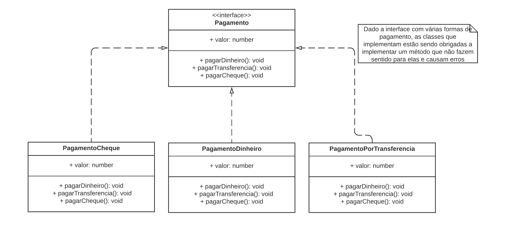
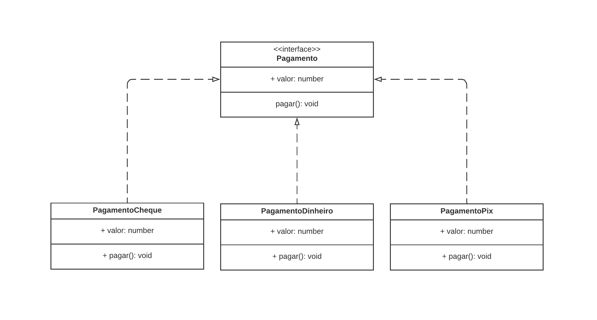

## Objetivo - 4

Recebemos um códgio onde é um módulo de pagamento, reponsável pelo sálario dos funcionários, compras da empresa e outras partes, trabalha com 3 formas de pagamento:

1. Dinheiro
2. Cheque
3. TED ou DOC

Novamente o módulo possui problemas de abstração, portanto devemos refazer as refatorações necessárias e substituir a transferencia por pix. A estrutura do código atualmente está assim:



Vamos fazer o seguinte, diminuir esse interface para ela ter apenas o método ‘`pagar()`'. Ficano da seguinte maneira:



## Princípio da segregação de interfaces

> _O princípio da segregação de Interface (ISP) afirma que nenhum cliente deve ser forçados a depender de métodos que não utiliza._ - Robert Cecil Martin

### Exemplo mais intuitivo


Fazendo essa separação com código, fica da seguinte maneira:

```tsx
// Exemplo errado
interface Cozinheiro {
  fazerPratoPrincipal(): string;
  fazerSobremesa(): string;
}

class ChefMestreCozinha implements Cozinheiro {
  fazerPratoPrincipal(): string {
    return "Salmão grelhado ao molho de limão siciliano com risoto de ervas frescas";
  }
  fazerSobremesa(): string {
    return "Tiramisù de frutas vermelhas com calda de framboesa";
  }
}
class ChefApenasDoces implements Cozinheiro {
  fazerPratoPrincipal(): string {
    throw new Error("Faço apenas pratos doces");
  }
  fazerSobremesa(): string {
    return "Taça de morangos com chantilly e crocante de amêndoas";
  }
}
```

```tsx
//Exemplo correto
{
  interface Cozinheiro {
    fazerPratoPrincipal(): string;
  }

  interface Confeiteiro {
    fazerSobremesa(): string;
  }

  class ChefMestreCozinha implements Cozinheiro, Confeiteiro {
    fazerPratoPrincipal(): string {
      return "Salmão grelhado ao molho de limão-siciliano com risoto de ervas frescas";
    }

    fazerSobremesa(): string {
      return "Tiramisu de frutas vermelhas com calda de framboesa";
    }
  }

  class ChefApenasDoces implements Confeiteiro {
    fazerSobremesa(): string {
      return "Taça de morangos com chantilly e crocante de amêndoas";
    }
  }
}
```

## Refatorando interfaces sobrecarregadas

vamos começar alterando o interface removendo todas as funções e deixando apenas o método ‘`pagar`'

```tsx
interface Pagamento {
  valor: number;
  pagar(): void;
}
```

agora em cada classe, so vamos chamar o método pagar e remover os outros que não vão ser usados:

```tsx
class PagamentoCheque implements Pagamento {
  valor: number;

  constructor(valor: number) {
    this.valor = valor;
  }

  pagar(): void {
    console.log(`O pagamento de ${this.valor} será feito por cheque.`);
  }
}

class PagamentoDinheiro implements Pagamento {
  valor: number;

  constructor(valor: number) {
    this.valor = valor;
  }

  pagar(): void {
    console.log(`O pagamento de ${this.valor} será feito por dinheiro.`);
  }
}

class PagamentoPorPix implements Pagamento {
  valor: number;

  constructor(valor: number) {
    this.valor = valor;
  }

  pagar(): void {
    console.log(`O pagamento de ${this.valor} será feito por pix.`);
  }
}
```

para testarmos podemos fazer assim:

```tsx
const pagamentoCheque = new PagamentoCheque(100);
pagamentoCheque.pagar();

const pagamentoDinheiro = new PagamentoDinheiro(200);
pagamentoDinheiro.pagar();

const pagamentoPix = new PagamentoPorPix(300);
pagamentoPix.pagar();
```

```tsx
//output
O pagamento de 100 será feito por cheque.
O pagamento de 200 será feito por dinheiro.
O pagamento de 300 será feito por pix.
```
